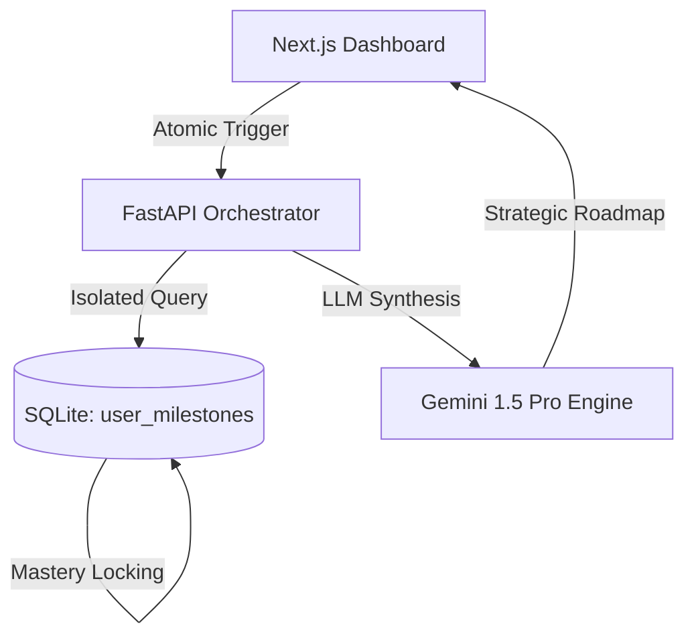

# 🌌 Strategic Career Ecosystem Engine

[](https://github.com/yourusername/career-mapper)
[](https://github.com/yourusername/career-mapper)

A high-performance, AI-driven career orchestration platform designed to map professional trajectories with atomic precision. This ecosystem utilizes an autonomous engine to analyze skill gaps and execute real-time strategic pivots.

---

## 🏗️ The "Zero-Leak" Architecture

Unlike traditional career trackers that suffer from state-bleed between roles, this system utilizes a **Relational Milestone Engine**. Every milestone is an atomic unit locked to a specific `User_ID` + `Career_Key`.



### Core Innovations
*   **Atomic Mastery Tracking**: Progression is saved server-side in real-time. Closing the browser or switching roles preserves exactly 100% of your progress.
*   **Dynamic Seniority Slicing**: The engine automatically promotes your rank (Entry → Intermediate → Senior) and hides base-level milestones as you evolve.
*   **Strategic Pivot Detection**: The engine calculates your proximity to 1,000+ roles simultaneously, identifying high-demand careers you are already 70%+ ready for.

---

## 🛠️ Technology Stack

### Frontend
- **Framework**: Next.js 15 (App Router)
- **Styling**: Tailwind CSS & Glassmorphism UI
- **Components**: Lucide Icons & Custom Framer-like animations
- **State**: Custom Auth-Context for lean session management

### Backend
- **Engine**: FastAPI (Python 3.11+)
- **Intelligence**: Google Gemini 1.5 Flash (Generative Roadmap Synthesis)
- **Database**: SQLite (ACID compliant career/user persistence)
- **Security**: Professional Audit Logging & Metadata-aware sessions

---

## 🚀 Quick Start

### 1. Environment Configuration
Create a `.env` file in the root directory:
```bash
# Core
ADMIN_USERNAME=MAK
GEMINI_API_KEY=your_gemini_key_here

# Settings
APP_TITLE=Strategic Career Ecosystem
```

### 2. Installation
```bash
# Backend
pip install -r requirements.txt

# Frontend
cd frontend
npm install
```

### 3. Execution
```bash
# Terminal 1: Backend
python server.py

# Terminal 2: Frontend
cd frontend
npm run dev
```

---

## 🛡️ Administrative Oversight
The system includes a secure **Ecosystem Command Center** (Admin Panel) accessible only to the configured `ADMIN_USERNAME`. It provides real-time telemetry on user growth, security audit logs, and global career demand metrics.

---

> [!TIP]
> **Engineering Note**: This project was architected to demonstrate senior-level proficiency in **State Isolation**, **Asynchronous AI Integration**, and **Professional UI/UX Design**.

